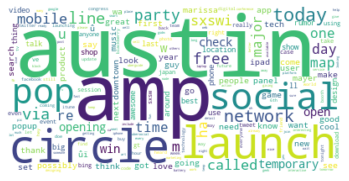
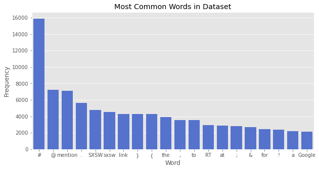
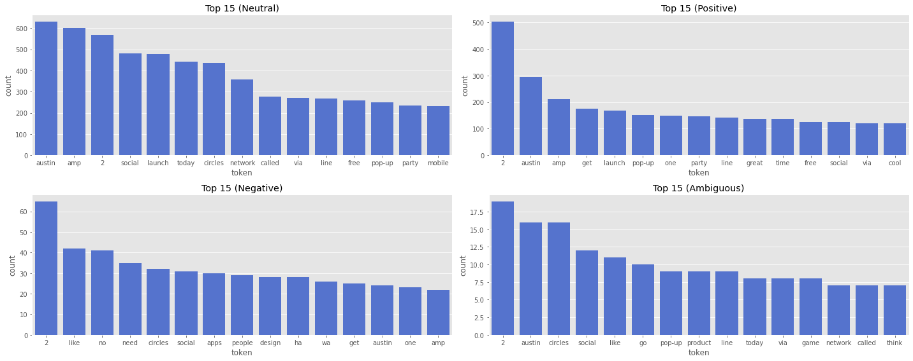
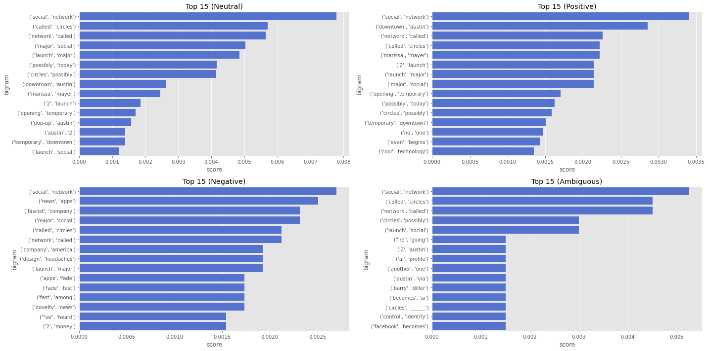
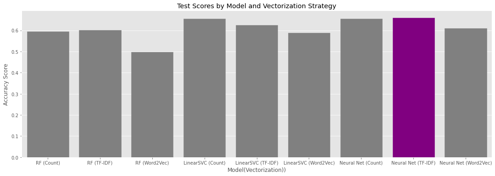

# Twitter Text Classification Using NLP



## README Outline
Within this [`README.md`](/README.md) you will find:
1. Introduction
2. Overview of Repository Contents
3. Project Objectives
4. Overview of the Process
5. Findings & Recommendations
6. Conclusion / Summary

## Introduction
This project uses Natural Language Processing and Machine Learning to train a classifier to predict the sentiment of tweets for use by product managers and investment relations professionals.

## Repository Contents
1. [`README.md`](README.md)
2. [`sentiment_nlp.ipynb`](sentiment_nlp.ipynb) - clean jupyter notebook containing all code
3. [`Tweet-Classification_Presentation.pdf`](Tweet-Classification_Presentation.pdf) - non-technical presentation summarizing methodology and findings
4. [`/imgs`](imgs) - image files for images contained in README

## Project Objectives
Build a classifier to predict whether a tweet is of positive, negative, or neutral sentiment, in context of product managers / public relations personnel tracking public sentiment related to certain events, releases, updates, etc. Follow CRISP-DM machine learning process to explore dataset, prepare data for modeling, modeling, and post-model evaluation.  Will be focused on accuracy as our main performance metric as context of false positives vs. false negatives is not as relevant with tweet data, especially given volume of it.  

## Overview of the Process:
Following CRISP-DM, the process outlined within `sentiment_nlp.ipynb` follows 5 key steps, including:
1. Business Understanding: Outlines facts and requirements of the project.  Specifically a classifier will be built and trained on twitter text data to predict whether that tweet is of positive, negative, or neutral sentiment. Understanding public sentiment surround product releases, updates, other pushes will be beneficial to product managers and public relations professionals to track the public's responses.
2. Data Understanding: focused on unpacking data available to us and leveraged throughout classification.  Section will focus on the distribution of our data, any imbalances within our target predictor, etc.
3. Data Preparation: further preprocessing of our data to prepare for modeling.  This includes splitting into training and testing sets, text processing, vectorization, and other techniques.
4. Modeling: this section iteratively trains a number of machine learning models, primarily focused on random forest classifiers, LinearSVC classifiers, and neural networks.
5. Evaluation: Final / optimal model is selected and final performance metrics of final model are discussed and evaluated.  Focused on accuracy as our performance metric.

### Business Understanding
This classifier will be created in the context of tracking public sentiment surrounding various product releases / events. Stakeholders for this project are likely product managers / investor and public relations professionals who are invested in how the public is feeling towards newly released products, and various other business proceedings. In conjunction with other tools, companies could use this classifier to create a sentiment score based on a certain number of recent tweets, and track that over time to monitor changes in sentiment over time. Additionally, companies could pull down a batch of tweets at certain times, filtered for various products or topics. If a broad enough sample is used, it could likely help provide good insight into whether consumers are feeling neutral, positive, or negative towards recent releases.

According to https://www.internetlivestats.com/twitter-statistics/ there are over 500 million tweets sent per day. Harnessing public sentiment from this amount of data would undoubtedly be helpful for tech companies looking to track how the public is feeling towards them. This classifier would likely be a valuable tool to complement public product reviews.

### Data Understanding
The main dataset containing raw tweet text and class labels comes from [CrowdFlower](https://data.world/crowdflower/brands-on-product-emotions), with the following description: *Contributors evaluated tweets about multiple brands and products. The crowd was asked if the tweet expressed positive, negative, or no emotion towards a brand and/or product. If some emotion was expressed they were also asked to say which brand or product was the target of that emotion.*

Note: when loading the dataset, the following encoding should be used to avoid import errors
```
# import dataset
raw_df = pd.read_csv('data/raw_tweets.csv', encoding='latin_1')
```

After performing some initial EDA and exploring the dataset, we see:
* Dataset is comprised of 9,092 tweets
* Dataset takes up just over 213.2KB of storage
* Total vocabulary of dataset is just 13,212 tokens
* Average tweet length is 24.2 words
* Most frequent words and tokens in the dataset are:



In addition to token frequency, bigrams and pointwise mutual information scores were evaluated by class label to understand how positive and negative tweets differed. The following visualizations of bigrams and PMI scores were produced to highlight differences between different sentiment tweets.

#### Top Words by Label


#### Top Bigrams



### Data Preparation
Following the genration of various corpus statistics, and understanding the dataset better through the data understanding phase, we can move on to data preparation.  

Steps in this process included: handling missing values, splitting the data into training and test sets for validation purposes later on, and a number of preprocessing and feature engineering steps.  

Raw tweets were processed using the following function I wrote.
```
def preprocess_tweet(tweet, stopwords_list):
    """
    Function to preprocess a tweet.
    Takes: tweet, stopwords list
    Returns: processed tweet with stopwords removed, lemmatized, and converted to lowercase
    """
    # remove apostrophes and excess white space
    processed = re.sub("\'", '', tweet)
    processed = re.sub('\s+', ' ', processed)

    # tokenize tweet
    tokens = nltk.word_tokenize(processed) # tokenize

    # lemmatize tokens
    lemmatizer = WordNetLemmatizer()
    lemmatized_tokens = [lemmatizer.lemmatize(token) for token in tokens]

    stopwords_removed = [token.lower() for token in lemmatized_tokens if token.lower() not in stopwords_list]
    return ' '.join(stopwords_removed)
```

Additionally, I evaluated the impacts of using multiple vectorization strategies, including count-vectorized data, TF-IDF vectorized data, and word2vec vectorized data.

```
# create vectorizers with unigram and bigrams
count_vectorizer = CountVectorizer(ngram_range=(1,2), analyzer='word')
tfidf_vectorizer = TfidfVectorizer(ngram_range=(1,2), analyzer='word')

# fit to preprocessed data
X_train_count = count_vectorizer.fit_transform(X_train_preprocessed)
X_test_count = count_vectorizer.transform(X_test_preprocessed)
X_train_tfidf = tfidf_vectorizer.fit_transform(X_train_preprocessed)
X_test_tfidf = tfidf_vectorizer.transform(X_test_preprocessed)
```

For Word2Vec, and word embeddings, I took advantage of Global Vectors for Word Representation (GloVe).  More information on this can be found [here](https://nlp.stanford.edu/projects/glove/).

The following function returns appropriate vectors from GloVe that are found in our dataset.

```
def glove_vectors(vocab):
    """
    Returns appropriate vectors from GloVe file.
    Input: vocabulary set to use.
    """
    glove = {}
    with open('data/glove.6B.50d.txt', 'rb') as f:
        for line in f:
            parts = line.split()
            word = parts[0].decode('utf-8')
            if word in vocab:
                vector = np.array(parts[1:], dtype=np.float32)
                glove[word] = vector
    return glove

# call function
glove = glove_vectors(total_train_vocab)
```

Set up W2vVectorizer class to produce word2vec vectorized data:
```
class W2vVectorizer(object):

    def __init__(self, w2v):
        # Takes in a dictionary of words and vectors as input
        self.w2v = w2v
        if len(w2v) == 0:
            self.dimensions = 0
        else:
            self.dimensions = len(w2v[next(iter(glove))])

    # Note: Even though it doesn't do anything, it's required that this object implement a fit method or else
    # it can't be used in a scikit-learn pipeline  
    def fit(self, X, y):
        return self

    def transform(self, X):
        return np.array([
            np.mean([self.w2v[w] for w in words if w in self.w2v]
                   or [np.zeros(self.dimensions)], axis=0) for words in X])
```

With this class created, can move forward with vectorizing the data.

```
# instantiate vectorizer objects with glove
w2v_vectorizer = W2vVectorizer(glove)

# transform training and testing data
X_train_w2v = w2v_vectorizer.transform(tokenized_X_train)
X_test_w2v = w2v_vectorizer.transform(tokenized_X_test)
```

### Modeling
The modeling section uses the three forms of vectorization and iteratively applies three types of machine learning models to find the best performer.  The three types of models used are: Random Forests, Linear SVC, and Neural Networks.

For each model, a baseline was created with testing and training accuracy scores produced for each vectorization method. Following the creation of a baseline, gridsearch was used to tune hyperparams, once for each vectorization strategy.  

The best model and vectorization strategy were identified for each model iteration, ultimately selecting the best performer for text classification.

### Evaluation
All models were evaluated for training and testing accuracy scores, overfitting, and runtime.  

Looking at the comparison of accuracy scores between our different model, it appears using a neural network with TF-IDF vectorized data is producing the best results.  Additionally, when considering training times, LinearSVC on count vectorized data performed the best, with Neural Networks coming second.



## Findings & Recommendations
The best performing model we saw was a neural network trained on TF-IDF vectorized data.  With a testing accuracy score of ~64% our model is expected to generalize fairly well and produce proper class labeling 64% of the time.  Given imbalanced dataset to begin with, and lack of negative class labels, it may be beneficial to find labels for more negative tweets / go back in time when it was known that public sentiment was not at it's highest.  More training data would be beneficial in this scenario.  I recommend using this classifier in conjunction with other tools to monitor public relations surrounding product launches and other releases or events.

## Conclusions & Summary
Through an iterative modeling and data preparation process, we were able to tune a model with ~64% testing accuracy.  Through this process accuracy score was selected as the main performance metric.  Training times were also considered as part of the evaluation phase.  

Utilize this classifier to produce a sentiment score to track releases in the future.
